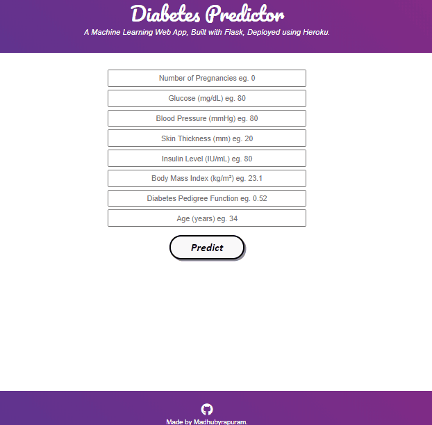

# Diabetes_Prediction

- This repository consists of files required to predict the Diabetes.The web app is based on Machine learning  and designed with Flask library in Python.
The created web app deployed on Heroku platform.
- To view the deployed model, please click on the link: <https://diabetes-predictor-ap.herokuapp.com/>

- Web app preview:

  

